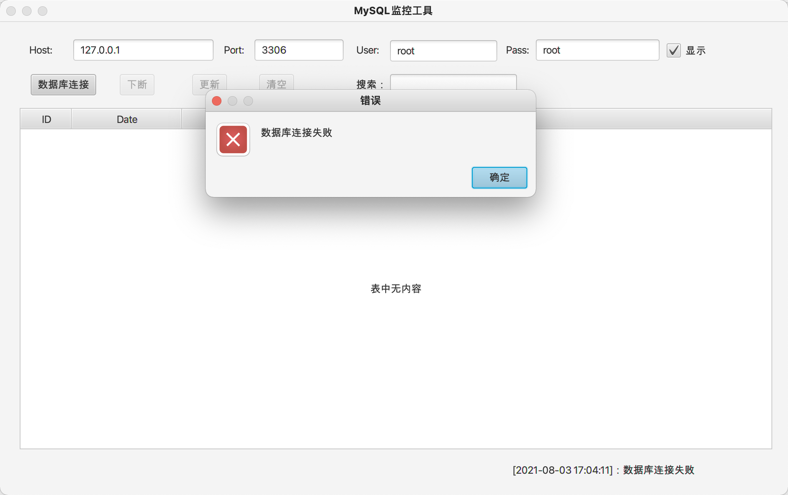
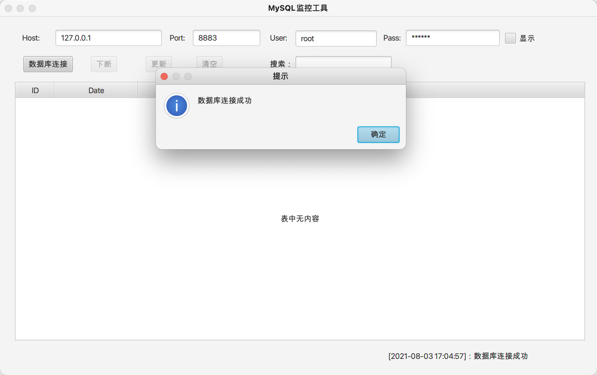
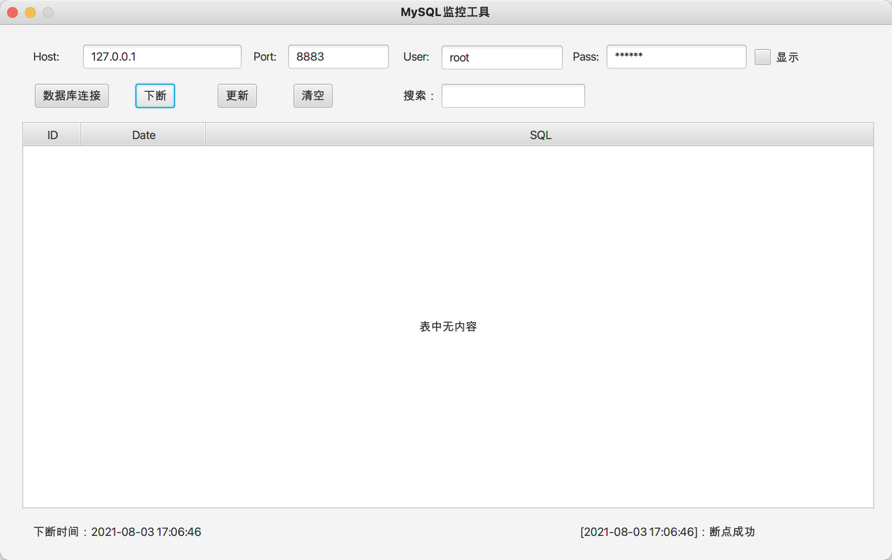
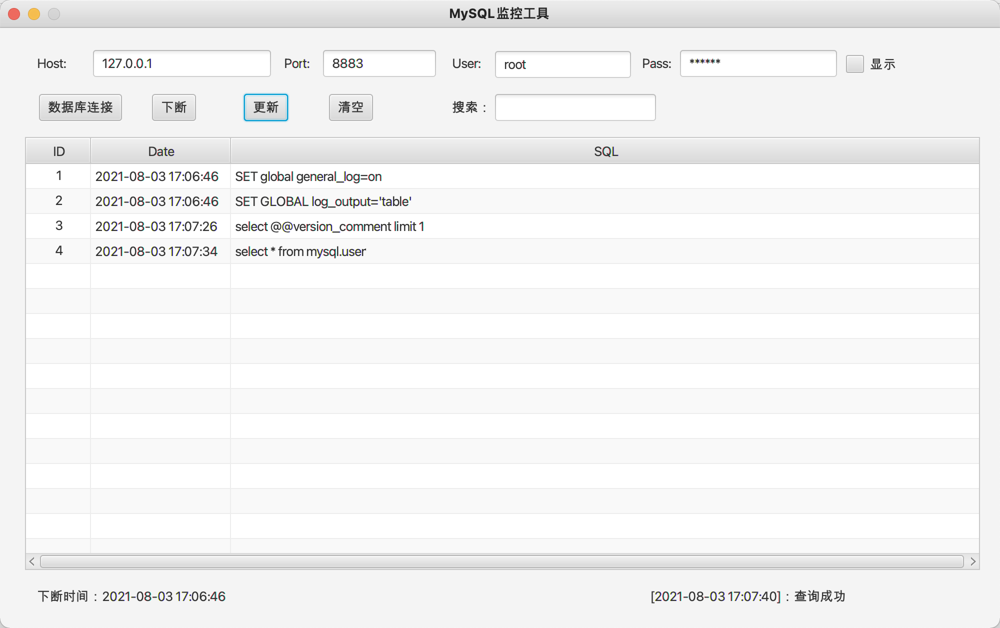
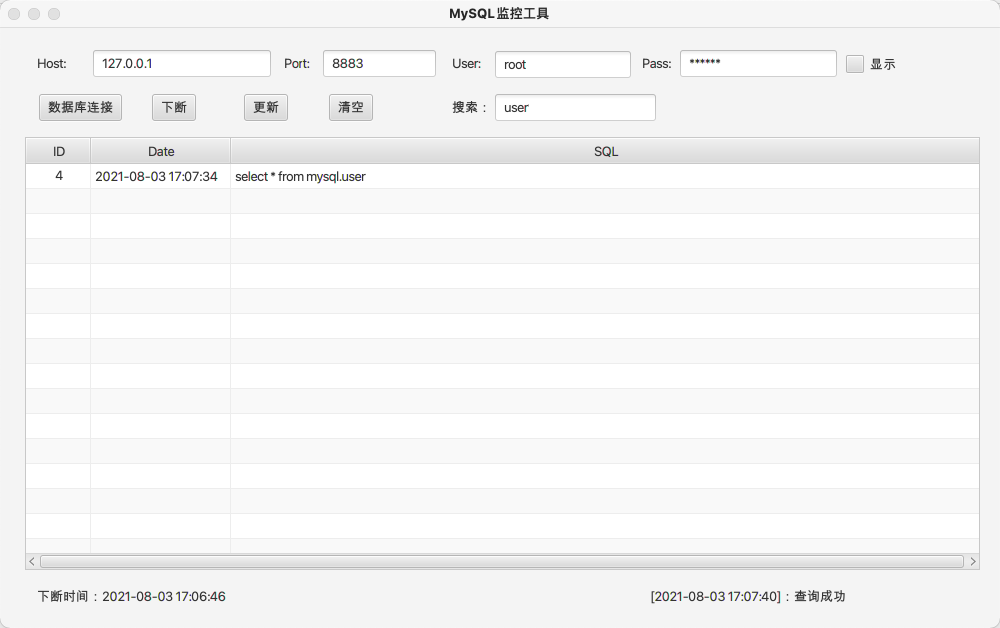
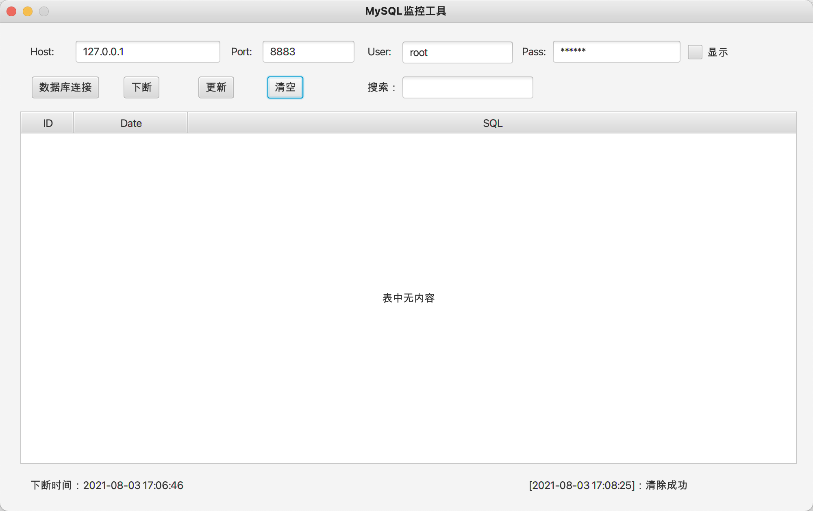
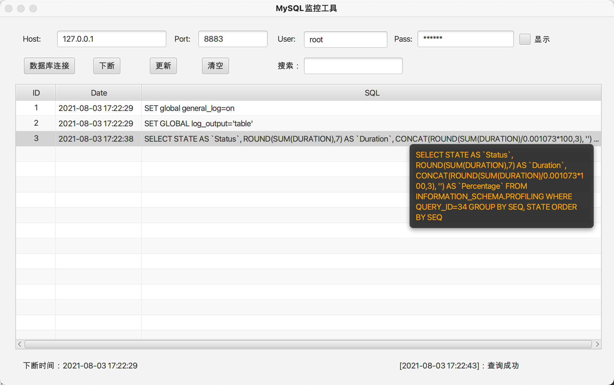

# MySQLMonitor
MySQL实时监控工具（代码审计、黑盒测试辅助工具）

## 使用
1.自行打包使用

```
git clone https://github.com/fupinglee/MySQLMonitor
cd MySQLMonitor
mvn clean package -DskipTests=true
```
打开target下的jar文件即可执行

2.直接下载使用

https://github.com/fupinglee/MySQLMonitor/releases
## 使用说明

### 数据库连接
数据库连接失败，下断、更新、清空等按钮不可用


数据库连接成功，下断按钮可以使用，更新、清空等按钮不可用



### 下断
下断点后可以更新和清空


### 更新
点击更新查看执行的SQL语句


### 搜索
在搜索框里输入内容可以对所需要的sql语句进行过滤


### 清空
清空按钮清空表格里面的内容


### 其他
单击选中一行后，鼠标移动可以悬浮显示该行的sql语句

>双击可以复制sql语句到剪贴板上
